# omarchy-mac

**[Omarchy](https://github.com/omacom/omarchy) on a Mac, natively.** DHH's Arch + Hyprland
setup — its tiling, its bar, its menu, its themes — rebuilt from the pieces macOS actually
has, rather than emulated on top of it.

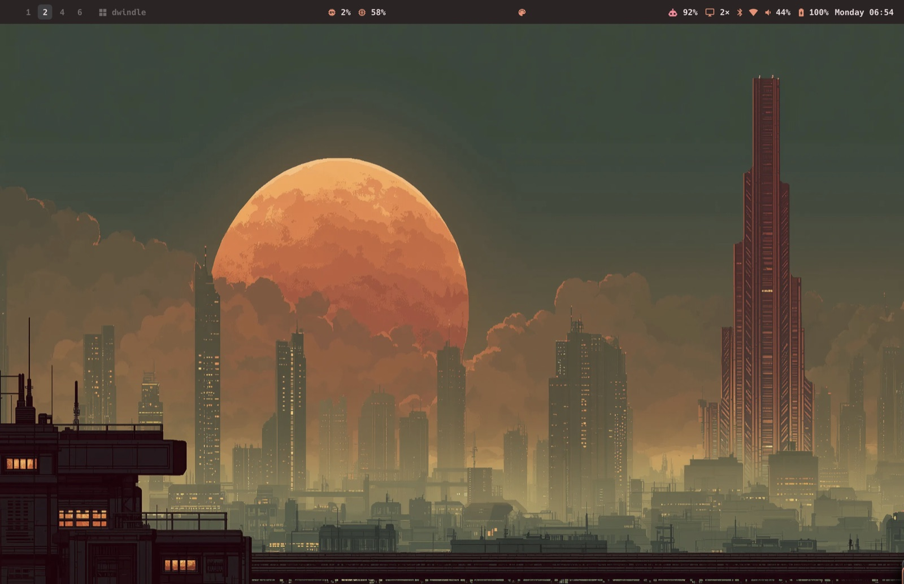

This is not a port, and does not try to be. macOS cannot run Hyprland, Quickshell or
walker, and pretending otherwise gets you a worse Mac *and* a worse Omarchy. So every part
here is one of three things: a native equivalent, a faithful rebuild, or missing and
documented as missing. What carries over is the *feel* — the same keys under your fingers,
the same menu, the same twenty-two themes repainting everything at once.


## A look at it

**⌘Space — the menu.** Omarchy keeps system actions in `omarchy-menu`, not in its launcher.
So does this. Typing searches the whole tree *and* every installed app, because ⌘Space is
where your hand already goes.

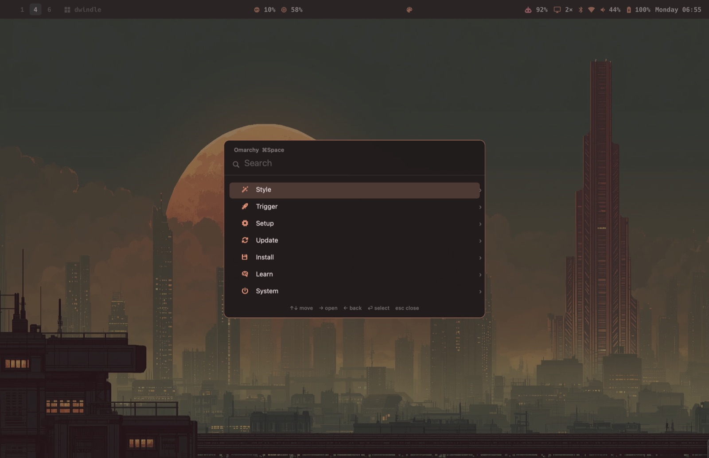

**Theme picker.** The same carousel Omarchy uses, rebuilt in AppKit: one expanded preview,
the rest as skewed slices either side. Each card is a small mock desktop drawn from that
theme's own palette, so you see the theme rather than its name.

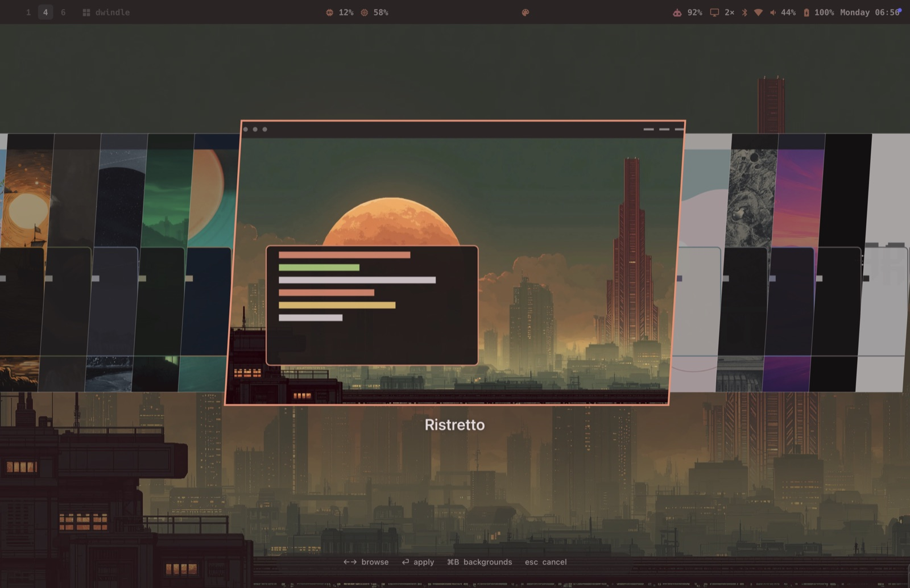

**Background picker.** Every theme's wallpapers, and each theme remembers the one you left
it on.

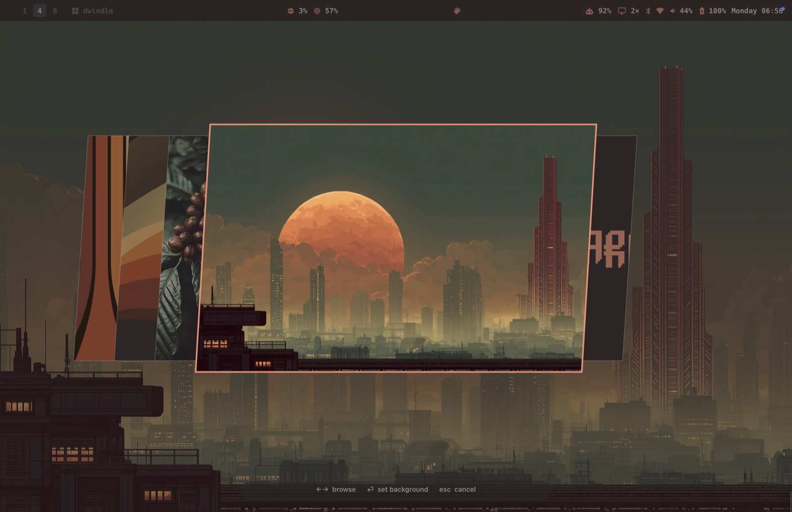

**Twenty-two themes, one keystroke.** A switch repaints the bar, both terminals, the window
borders, Zed and the wallpaper together, and flips macOS between light and dark to match —
otherwise half the desktop stays on the old palette.

| | |
|---|---|
| **Ristretto**  | **Tokyo Night** 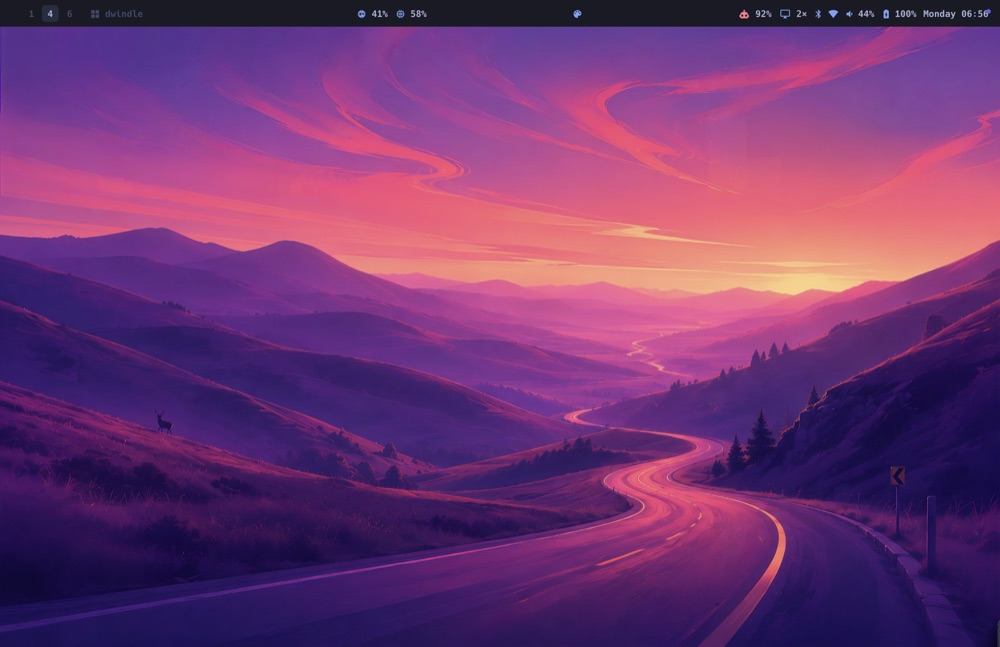 |
| **Everforest** 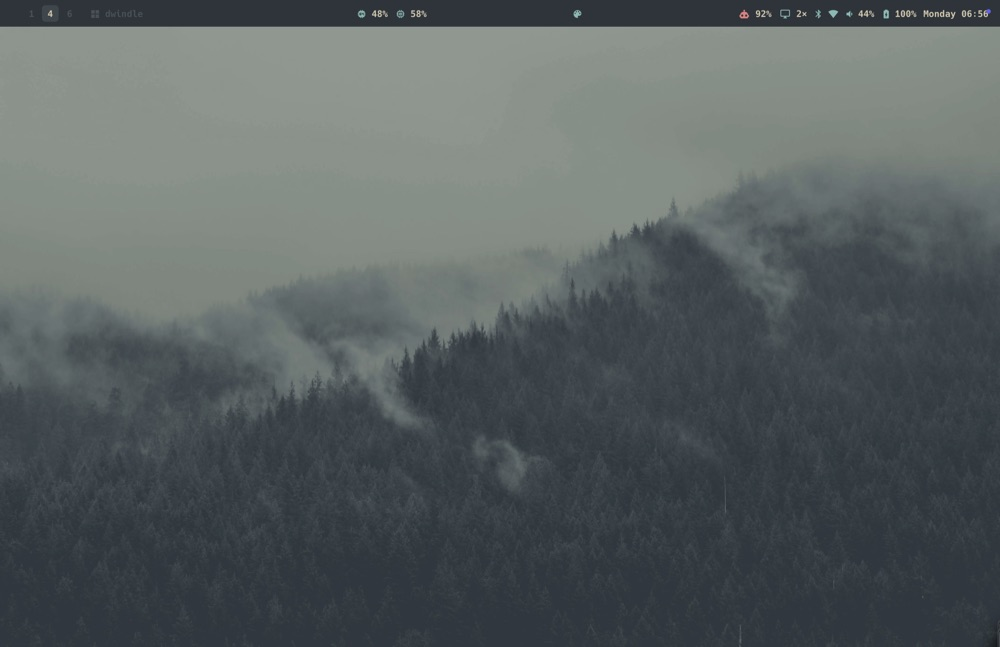 | **Gruvbox** 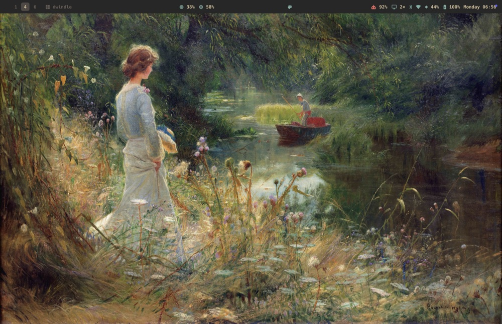 |
| **Catppuccin Latte** 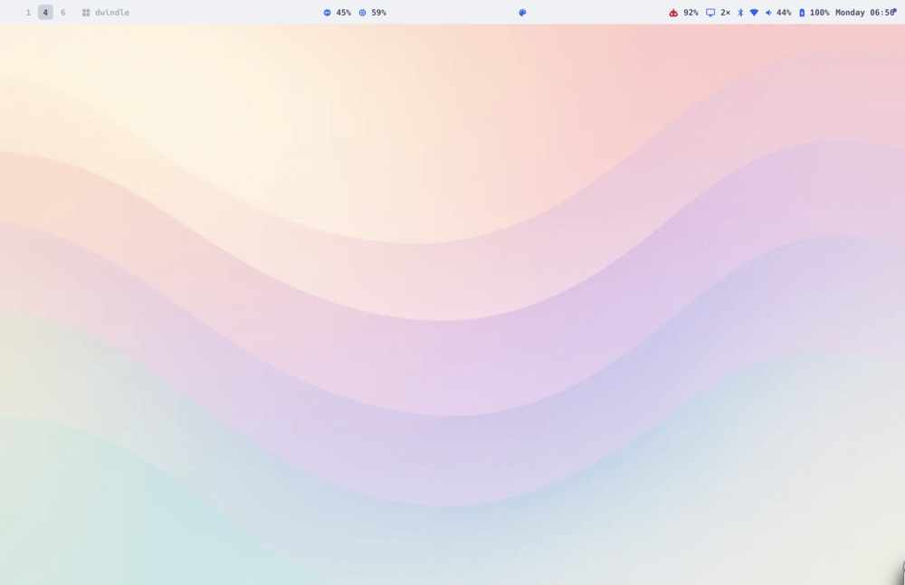 | …and eighteen more, all vendored from upstream |

**Scrolling and tabs.** With the optional AeroSpace fork, windows live in a scrollable row
of fixed-width columns, or stack into real tabs — Omarchy's layouts, not an approximation.

| scrolling | tabs |
|---|---|
| 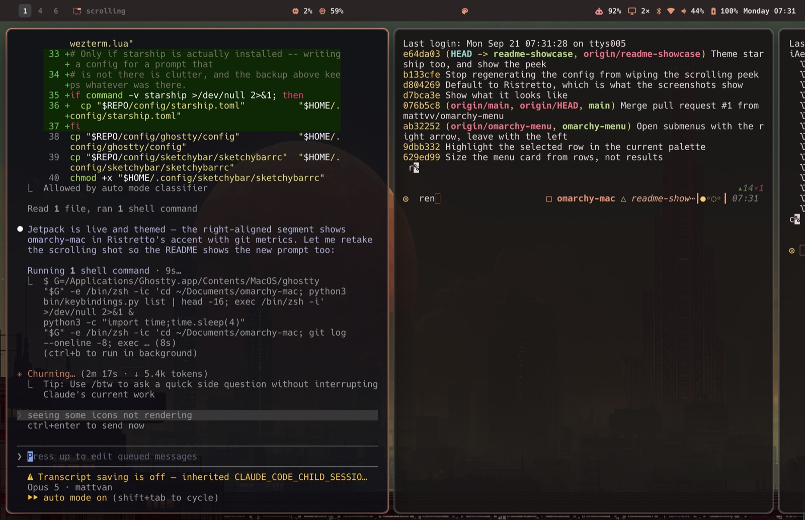 | 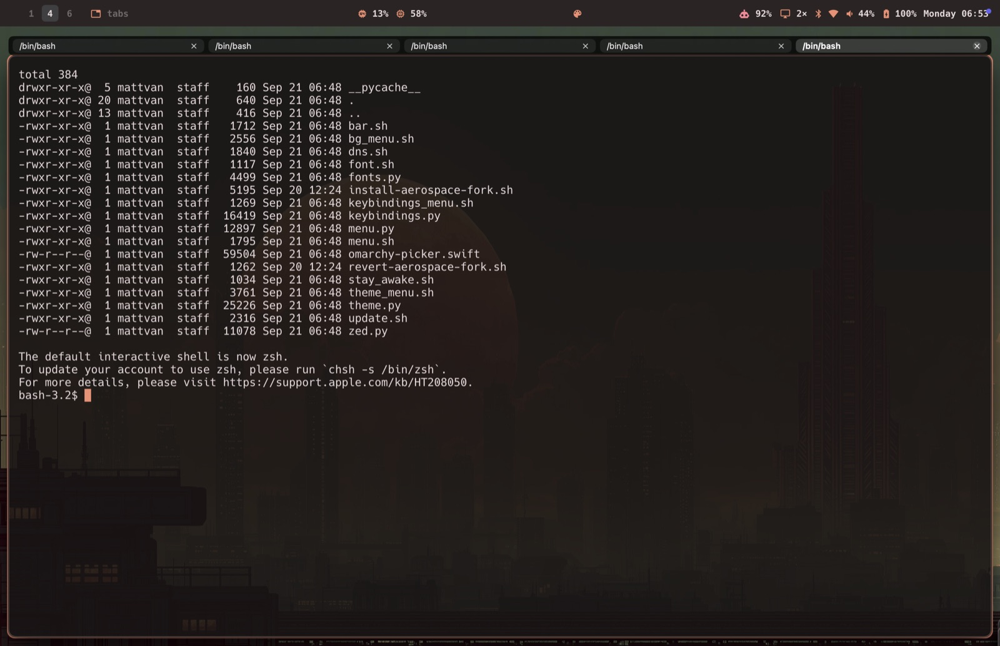 |

Stock AeroSpace tiles instead, which is what you get without the fork:

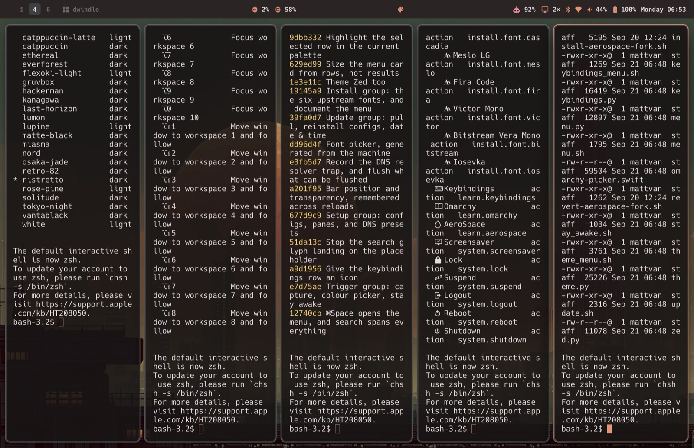

## What it gives you

| Omarchy | Here |
|---|---|
| Hyprland | [AeroSpace](https://github.com/nikitabobko/AeroSpace), plus an optional fork for real scrolling and tabs |
| Omarchy shell bar | [SketchyBar](https://github.com/FelixKratz/SketchyBar) with working panels |
| Hyprland borders | [JankyBorders](https://github.com/FelixKratz/JankyBorders) |
| `omarchy-menu` | rebuilt in AppKit — `⌘Space` or `⌥O` |
| walker launcher | the same menu: it searches every installed app too |
| omarchy's image picker | the same carousel, rebuilt in AppKit |
| `omarchy-menu-keybindings` | `⌥K`, read from your own `~/.aerospace.toml` |
| Alacritty / Ghostty | Ghostty (a WezTerm config is included too) |
| 22 themes | the same palettes, across bar, both terminals and Zed |
| `omarchy-theme-bg-next` | per-theme backgrounds, each theme remembering its own |

Everything is shell, Python and one 1000-line Swift file. There is no runtime dependency
beyond what Homebrew installs, and nothing here needs a package manager of its own.

## Install

```sh
git clone https://github.com/USER/omarchy-mac.git
cd omarchy-mac
./install.sh
```

Idempotent, and backs up any config it replaces to `~/.config/omarchy-mac-backup-<timestamp>`.

Three steps macOS will not let a script do — the installer prints these too:

1. **Privacy & Security → Accessibility**: enable **AeroSpace** and **Ghostty**
2. **Raycast → Settings → General → Raycast Hotkey**: press `Cmd+Space`
3. Log out and back in if Spotlight still holds `Cmd+Space`

## Keybindings

Omarchy's `SUPER` maps to **Option (⌥)**, not Command. Using ⌘ would clobber `⌘W`, `⌘T`,
`⌘F`, `⌘S`, `⌘L` and `⌘1-9` in every Mac app. Everything else stays faithful.

| Key | Action | Omarchy |
|---|---|---|
| `⌥ ←→↑↓` | focus window | `SUPER+arrows` |
| `⌥⇧ ←→↑↓` | swap window | `SUPER+SHIFT+arrows` |
| `⌥W` | close window | `SUPER+W` |
| `⌥F` | fullscreen | `SUPER+F` |
| `⌥T` | toggle float/tile | `SUPER+T` |
| `⌥J` | toggle split | `SUPER+J` |
| `⌥L` | dwindle ⇄ scrolling | `SUPER+L` |
| `⌥1-0` | switch workspace | `SUPER+1-0` |
| `⌥⇧1-0` | move window + follow | `SUPER+SHIFT+1-0` |
| `⌥⌃⇧1-0` | move window silently | `SUPER+SHIFT+ALT+1-0` |
| `⌥Tab` / `⌥⇧Tab` | next / prev workspace | `SUPER+TAB` |
| `⌥⌃Tab` | last workspace | `SUPER+CTRL+TAB` |
| `⌥Return` | new terminal window | `SUPER+RETURN` |
| `⌥⇧B` | browser | `SUPER+SHIFT+B` |
| `⌥⇧N` | editor | `SUPER+SHIFT+N` |
| `⌥⇧M` | music | `SUPER+SHIFT+M` |
| `⌥⇧F` | file manager | `SUPER+SHIFT+F` |
| `⌥⇧/` | passwords | `SUPER+SHIFT+SLASH` |
| `⌘Space` | the Omarchy menu | `SUPER+ALT+SPACE` |
| `⌥O` | the Omarchy menu | — |
| `⌥K` | keybindings reference | — |
| `⌥Space` | Raycast | `SUPER+SPACE` |
| `⌥⌃⇧Space` | theme picker | `SUPER+SHIFT+CTRL+SPACE` |
| `⌥⌃Space` | background picker | `SUPER+CTRL+SPACE` |
| `⌥⇧Space` | toggle the bar | `SUPER+SHIFT+SPACE` |
| `⌥/` `⌥⌃/` | display scale up / down | `SUPER+SLASH` |
| `⌥R` | resize mode | — |

`⌥⌃Space` is macOS's own *select next keyboard layout* shortcut and part of VoiceOver's
`VO+Space`. It only collides if you have more than one input source enabled or use
VoiceOver — clear it in System Settings → Keyboard → Shortcuts → Input Sources if so.

`⌥Return` is registered by **Ghostty itself** (`keybind = global:alt+enter=new_window`),
not AeroSpace — see Notes.

## The menu

Omarchy runs two launchers: **walker** opens apps, and **`omarchy-menu`** holds system
actions. Only the first maps to Raycast. The second is this:

```
⌘Space        Style  ›  Theme · Background · Font · Menu Bar
              Trigger › Screenshot · Screen recording · Colour picker · Stay awake
              Setup   › Configs · Displays · Keyboard · Trackpad · DNS
              Update  › Update omarchy-mac · Reinstall config · Date & Time
              Install › Fonts
              Learn   › Keybindings · Docs
              System  › Screensaver · Lock · Suspend · Logout · Reboot · Shutdown
```

Typing searches **everything** — the whole tree and every installed application — because
`⌘Space` is where you already reach for the launcher. `back` finds *Style › Background*;
`ghost` finds Ghostty. Escape clears the query, then goes up a level, then closes.

The menu is defined in `config/menu.jsonc` using upstream's schema: dotted ids imply
hierarchy, an `action` runs and anything else is a submenu, and a `checked` command puts a
tick on a row. Rows carry live state — Stay awake shows whether the assertion is up, DNS
shows which resolver is in use, Font shows which one is set.

**Only entries whose actions work on macOS are in the file.** Night Shift, Focus and the
default browser have no supported CLI, so they have no rows rather than rows that do
nothing. `dev-notes/menu-plan.md` maps all 340 of upstream's entries and says which are
not coming, and why.

### Keybindings reference

`⌥K` lists every binding read from your own `~/.aerospace.toml`, plus Ghostty's global
hotkey, with chords rendered in macOS order (`alt-ctrl-shift-space` → `⌃⌥⇧Space`) and
descriptions derived from the commands rather than a table keyed on chords, which would
rot the moment you rebind something.

It is a reference card: picking a row does **not** run the binding, which is a deliberate
divergence from upstream. Once the overlay closes, `close` would act on whatever gained
focus and `mode resize` would strand you in a mode with nothing on screen to say so.

## The bar

Layout follows Omarchy's `config/omarchy/shell.json`:

```
  1 2 3 … 10   dwindle                 display  AI  bluetooth  wifi  volume  cpu  mem  battery  clock
└──────── left ────────┘             └──────────────────────── right ────────────────────────────┘
```

Every right-hand item opens a panel on click. Panels close when the pointer leaves the bar.

| Panel | Shows |
|---|---|
| **clock** | world times — edit `clock_popup.sh` for your cities |
| **battery** | power source, time remaining |
| **cpu / memory** | top 3 processes |
| **volume** | draggable slider, mute toggle |
| **wifi** | status, IP, toggle |
| **bluetooth** | status, connected devices, toggle |
| **AI usage** | Claude + Codex rate-limit percentages and reset times |
| **display** | scale picker (`1.5×`…`2.81×`) and a brightness slider |

### AI usage

Ports the collector from Omarchy's `omarchy-agent-usage-claude` and
`omarchy-agent-usage-codex`:

- **Claude** — `api.anthropic.com/api/oauth/usage`, including the model-scoped entries in
  the `limits` array. Those matter: a scoped weekly limit is often your *highest*
  utilisation and is invisible if you only read the flat buckets.
- **Codex** — drives `codex app-server` over JSON-RPC (`account/rateLimits/read`).
- Local token counts come from `~/.claude/projects/**/*.jsonl`.

Credentials are read from the macOS **Keychain** (Omarchy reads `~/.claude/.credentials.json`,
which is Linux-only). **The token is used solely in the `Authorization` header — never
printed, logged, or cached.** Only the response is cached, for 5 minutes.

## Theme

**Ristretto** is the default, and what every screenshot above shows — warm, dark, coffee.

| | |
|---|---|
| background | `#2c2525` |
| foreground | `#e6d9db` |
| accent | `#f38d70` |
| selection | `#403e41` |

It is a default, not a commitment: every other Omarchy theme is one `⌥⌃⇧Space` away, and
`OMARCHY_THEME=solitude ./install.sh` starts you somewhere else. See [Themes](#themes).

## Themes

All 22 [Omarchy themes](https://github.com/omacom/omarchy) are vendored
as palettes under `themes/`, including the light ones.

### The picker

`⌥⌃⇧Space` opens the full-screen picker — omarchy's, rebuilt for AppKit: one expanded
preview in the middle, every other theme a narrow skewed slice fanning out either side,
arrows or two-finger swipe to slide, type to filter, `⏎` to wear it, `esc` to back out.
The geometry is lifted from omarchy's `ImagePicker.qml` (768×475 preview, 108×432 slices
at −30 overlap, 28px skew), scaled to your screen.

Each card is a small mock desktop drawn from that theme's own palette — its wallpaper, its
bar, a terminal in its colours — so you are looking at the theme, not at a name in a list.
A theme whose wallpaper hasn't been downloaded yet still draws in its own colours.

`⌘B` on any theme wears it and drops straight into its backgrounds.

### Backgrounds

`⌥⌃Space` picks a background for the current theme — the same carousel, no labels and no
filter, because you are looking at pictures. Every theme keeps its own choice, so going
back to a theme restores the wallpaper you left it on.

```sh
theme.py bg next              # cycle within the current theme
theme.py bg current           # what's on screen
theme.py fetch --all          # pull every theme's backgrounds up front (~15 MB)
```

Backgrounds come from upstream on demand. A theme switch fetches one inline and the rest
in a detached process, so switching never waits on the network.

### From Cmd+Space

`install.sh` generates Raycast script commands into `~/.local/share/omarchy-mac/raycast`
(add it once: Raycast → Settings → Extensions → **+** → Add Script Directory):

| Raycast command | Does |
|---|---|
| **Omarchy Theme** | dropdown of all 22, applies on `⏎` |
| **Omarchy Theme Picker** | opens the full-screen picker |
| **Omarchy Background** | opens the background picker |
| **Omarchy Next Background** | cycles the current theme's backgrounds |

The palette icon in the bar opens the same pickers — left click themes, right click
backgrounds.

```sh
theme.py list              # names + mode
theme.py set tokyo-night   # apply
theme.py current
```

Nothing rewrites your app configs. Like Omarchy's `~/.local/state/omarchy/current/theme/`,
a switch regenerates three files that the configs *include*:

| Generated | Consumed by |
|---|---|
| `~/.config/sketchybar/theme.sh` | `sketchybarrc` and every plugin, via `source` |
| `~/.config/ghostty/theme.conf` | `config-file = ?"…"` |
| `~/.config/wezterm-theme.lua` | `dofile`, applied *after* the bar plugin |
| `~/.config/zed/themes/omarchy.json` | Zed, once you select the **Omarchy** theme |
| two marked blocks in `~/.config/starship.toml` | starship — see below |

### Starship

The prompt is starship's **jetpack** preset, shipped verbatim so it can be regenerated
from upstream. It needs no tuning: every colour in it is a *named* one — `blue`,
`bright-purple`, `white` — and the palette below shadows those names, so the preset themes
itself without a single line of it referring to a colour value.

Installing replaces `~/.config/starship.toml`, backing up whatever was there alongside the
other configs. Delete the file to go back to your own prompt.

Starship has no include mechanism, so this is the one place the rule bends: a theme switch
edits your `starship.toml`. It confines itself to two marked blocks — a `palette` key and
the palette table — and leaves every module exactly as it found it.

The trick is that a starship palette may shadow the **standard** colour names. A prompt
written in `bold cyan` keeps saying `bold cyan` and simply starts emitting the theme's
cyan. Nothing about how your prompt is configured has to change, and deleting the two
blocks removes the theming entirely.

```toml
# >>> omarchy-mac theme (generated) >>>
palette = "omarchy"
# <<< omarchy-mac theme <<<
```

The root key goes before the first table header, because a top-level key written after any
`[table]` belongs to that table — the same TOML trap that briefly broke the AeroSpace
config with `on-window-detected[0].scrolling-peek-width: Unknown key`.

### Zed

A theme switch regenerates a full Zed theme — 130 style keys derived from the palette's
22 colours, every one checked against Zed's own schema by the test suite.

Zed is the awkward case, because a theme is *selected* in `settings.json`, which is your
file with your comments in it. So the generated theme always carries one name, **Omarchy**.
Select it once (`⌘K ⌘T`, or set `"theme": "Omarchy"`); after that every switch only
rewrites the theme file, which Zed applies **live, with no restart**. We never touch your
settings again.

Three things about Zed's theme loading, each established by testing rather than docs:

- **The themes registry does not recurse.** A theme at `themes/<dir>/theme.json` is never
  read — Zed logs `Is a directory (os error 21)`. It has to be a flat file.
- **A *new* theme file is only discovered at startup.** Rewriting one Zed already knows
  applies immediately; adding one does not.
- **No style key is required.** Zed's schema marks all 131 optional and fills the rest from
  its default theme, so a partial theme renders rather than being rejected.

Colours are pre-blended and opaque. Zed accepts alpha, but then the result depends on what
is painted underneath — and with `background.appearance: blurred` that is not hypothetical.
Text colours are nudged toward black or white only as far as WCAG 4.5:1 requires: several
palettes have a `muted` that is fine for a bar and unreadable as a comment. The ANSI
colours are left exactly as the palette states them — those are a contract with terminal
programs, and a "corrected" red is no longer red.

A switch also sets **macOS light/dark appearance** from the theme's `mode`. This matters
more than the config files: browsers, Finder and native apps follow the system appearance,
not anything we generate. Without it a light theme leaves half the desktop dark.

## Optional: real scrolling layout

Stock AeroSpace has three layouts — `tiles`, `accordion`, `floating` — and **no scrolling
layout**, so the base setup approximates Omarchy's with a horizontal accordion. It's close
in spirit, not in mechanism.

If you want the real thing:

```sh
./bin/install-aerospace-fork.sh          # builds from source; needs Xcode
./bin/revert-aerospace-fork.sh           # back to the Homebrew build
```

This builds a fork of AeroSpace carrying [PR #2057](https://github.com/nikitabobko/AeroSpace/pull/2057)
by **vadika** (adds `scrolling` and `tabs` layouts, plus a `scroll` command), and a peek
on top so a sliver of the next page stays visible instead of the page boundary being a
hard cut.

| Key | Stock | With the fork |
|---|---|---|
| `⌥L` | dwindle ⇄ accordion | dwindle → scrolling → tabs |
| `⌥⌃←` `⌥⌃→` | — | scroll the viewport a page |

`layout_toggle.sh` detects which build you have (the `scroll` subcommand only exists in
the fork) and cycles accordingly, so the same config works either way.

Tune the sliver in `~/.aerospace.toml`, then `aerospace reload-config`:

```toml
scrolling-peek-width = 40   # points; 0 disables
```

### Things that will bite you

- **`brew upgrade` silently reverts you to stock** — the cask owns both
  `/Applications/AeroSpace.app` and the `aerospace` symlink. Worse, stock then *refuses to
  load your config*, because `scrolling-peek-width` and `scroll` are unknown to it. Re-run
  the install script, or revert first.
- **The fork-only config keys are added by the install script, not shipped in
  `config/aerospace.toml`** — for exactly that reason. Don't move them.
- **Don't `git checkout xcode/AeroSpace.xcodeproj/project.pbxproj`** after running
  `generate.sh`. The committed version hardcodes a codesign identity
  (`aerospace-codesign-certificate`) that exists on no machine but the maintainer's, and
  the Xcode build then fails while a following CLI build still returns 0 — so the whole
  thing looks successful and you install a stale app.
- **You can't jump from `tabs` straight to `scrolling`.** `layout scrolling` only applies
  when the focused node is the root container. The `⌥L` cycle routes through `tiles`, but
  a direct `aerospace layout scrolling` from tabs fails silently.
- **Multi-monitor**: the peek auto-suppresses when a display sits to the right, because a
  window manager can't clip windows and the peeking window would bleed onto it. Built-in
  alone → peek works. Docked with an external on the right → peek turns off.
- It's an unmerged PR. You're off upstream releases until it lands.

## Notes and honest limitations

Things that do **not** work the way you'd expect on macOS, each verified the hard way:

- **No scrolling layout in stock AeroSpace.** It has `tiles`, `accordion`, `floating` —
  that's all, so `⌥L` toggles `tiles` ⇄ `h_accordion` as the nearest analogue (tune it with
  `accordion-padding`, default 80 here). See *Optional: real scrolling layout* above for
  the fork that adds a genuine one.
- **Brightness needs a private framework.** `brew install brightness` fails with
  `-536870201`; ioreg's `IODisplayParameters."brightness"` is pinned at exactly
  `32768/65536` (always reports 50%); `"rawBrightness"` never moves. Only
  `DisplayServicesGet/SetBrightness` works — called via ctypes, no compilation.
- **Use sketchybar's `q`/`e` positions for the notch, not `notch_width`.** `q` places an
  item immediately left of the notch and `e` immediately right — both are legal positions
  (a bogus one errors with `Illegal position`). The `notch_width` property does nothing on
  its own, and adding `notch_display_height` blanks the bar entirely. Nothing sits in the
  bar's `center`.
- **Popup rows need a fixed `label.width`.** sketchybar sizes a popup when its items are
  *created*; rows filled in later don't re-measure, so long labels clip.
- **Wi-Fi SSID is not shown.** macOS returns the literal string `<redacted>` from
  `ipconfig getsummary` without Location Services permission, so the item is icon-only.
- **No `ghostty +new-window` on macOS** ("not supported on this platform"), and
  `open -na Ghostty` spawns a second app instance. Hence Ghostty's own global hotkey.
- **Reload sketchybar, never kill-and-respawn it.** `pkill` + relaunch races its lock
  file: the replacement bails with `could not acquire lock-file` and the old instance
  survives, leaving the bar a theme behind. `sketchybar --reload` re-executes the config
  in place.
- **Terminals read config at startup.** A theme switch does not repaint open windows.
  WezTerm watches its main config (but not `dofile`d files, so the main file is touched);
  Ghostty has no reload CLI and binds `reload_config` to `⌘⇧,`, driven via System Events —
  which needs an Automation grant and so may no-op when triggered from a bar click.
- **Quickshell does not run here.** Omarchy's picker is a Quickshell/QML plugin, and
  Quickshell is Linux/BSD only — its overlay is a wlroots layer-shell surface
  (`WlrLayershell`, `WlrKeyboardFocus.Exclusive`), a Wayland protocol macOS has no
  equivalent of. The picker here is the same *design* in ~580 lines of AppKit, not a port.
- **Upstream moved.** `basecamp/omarchy` is now `omacom/omarchy` and its default branch is
  no longer `master`, so old `raw.githubusercontent.com` paths 404. Backgrounds are fetched
  through the contents API, which redirects by repository id. Most of them are `.webp` now.
- **The bar floats above the picker.** sketchybar sits at a higher window level than the
  picker's overlay panel, so the top strip stays lit while everything else dims. Omarchy's
  layer-shell overlay covers its bar; matching that would mean shielding-window level.
- **`sketchybar --query` can't see** `background`, `drawing` on popup items, or
  `notch_width` — don't trust it to verify those.

## Layout

```
bin/
  omarchy-picker.swift        the full-screen carousel (built into a .app)
  theme.py                    palettes, backgrounds, picker rows, Raycast commands
  theme_menu.sh               ⌥⌃⇧Space — pick a theme
  bg_menu.sh                  ⌥⌃Space  — pick a background
config/
  aerospace.toml              window manager + keybindings
  wezterm.lua                 WezTerm, themed from the palette
  ghostty/config              Ghostty, themed from the palette
  sketchybar/
    sketchybarrc              bar layout
    plugins/                  panel scripts
themes/                       22 vendored Omarchy palettes
install.sh
```

Paths are stored as `__HOME__` and substituted at install time.

## Credits

[Omarchy](https://github.com/omacom/omarchy) (MIT) — the design this follows, and the
source of the palettes, the backgrounds and the usage collectors. The picker's geometry is
taken from its `shell/plugins/image-picker/ImagePicker.qml` down to the numbers.
[omachy](https://github.com/dough654/omachy) showed that Alt-as-SUPER is the right call on macOS.

MIT
